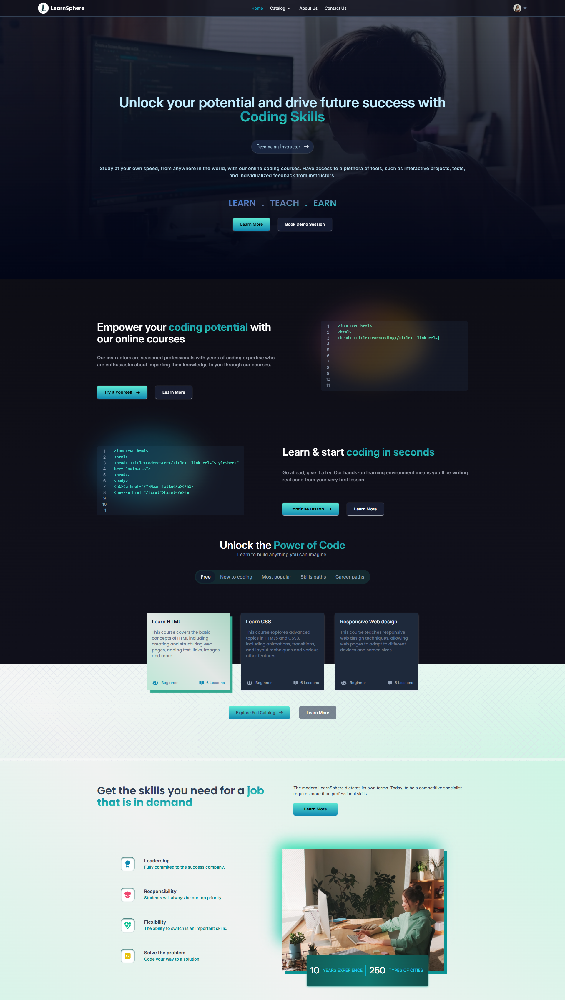

# LearnSphere - an EdTech Platform

🔗 [Visit my website](https://learn-sphere-edui.vercel.app)

## Introduction

LearnSphere is an EdTech platform designed to provide an accessible and interactive learning experience, making education both engaging and widely available. The platform also enables instructors to share their expertise with learners globally, connecting students and educators in a collaborative environment.

This document outlines the technical details of the platform, covering system architecture, API design, setup, usage instructions, and possible future improvements.

## System Architecture

The LearnSphere platform follows a client-server architecture, consisting of three main components: the front end, the back end, and the database. The front end functions as the client, while the back end and database serve as the server components, facilitating data exchange and operations.

## Front End

The front end is developed using ReactJS, allowing for the creation of dynamic and responsive interfaces that enhance the learning experience. Communication with the back end is achieved through RESTful API calls.

### Pages for Students

- **Homepage**: Provides a brief overview of the platform, with links to the course catalog and user profile.
- **Course List**: Displays available courses, along with descriptions and ratings.
- **Wishlist**: Shows all courses a student has added to their wishlist.
- **Cart Checkout**: Supports purchasing and enrolling in courses.
- **Course Content**: Contains the video lessons and related materials for each course.
- **User Details**: Displays the student’s account details, such as name and email.
- **User Edit Details**: Allows students to update their personal information.

### Pages for Instructors

- **Dashboard**: Summarizes the instructor's courses, including ratings and feedback.
- **Insights**: Provides metrics like course views and engagement statistics.
- **Course Management**: Enables course creation, updates, deletions, and pricing adjustments.
- **Profile Management**: Allows instructors to view and edit their profile details.

### Front-end Tools and Libraries

The front end is developed using a set of tools and libraries, including:

- **ReactJS**: Framework for building user interfaces.
- **CSS and Tailwind CSS**: For styling and layout.
- **Redux**: For state management.

## Back End

The back end is built with Node.js and Express.js, providing APIs that the front end can access. These APIs handle essential functions, including user authentication, course creation, and content management, as well as processing and storing data.

### Back-end Features

- **User Authentication and Authorization**: Students and instructors can sign up and log in with email and password, with OTP verification for added security. Password reset functionality is also provided.
- **Course Management**: Instructors can manage their courses, while students can view and review courses.
- **Payment Integration**: Integrated with Razorpay, allowing students to complete purchases and enrollments.
- **Cloud-based Media Management**: Media content (e.g., images, videos, documents) is managed using Cloudinary.
- **Markdown Support**: Course content is stored in Markdown format for easier rendering on the front end.

### Back-end Frameworks, Libraries, and Tools

The back end is built using a suite of tools to ensure robust performance:

- **Node.js**: Main runtime for back-end operations.
- **Express.js**: Web application framework providing essential web development features.
- **MongoDB**: NoSQL database for flexible and scalable data storage.
- **JWT (JSON Web Tokens)**: For secure authentication and authorization.
- **Bcrypt**: For password hashing, ensuring data security.
- **Mongoose**: ODM library for interacting with MongoDB.

## Data Models and Database Schema

LearnSphere uses various schemas to organize data effectively:

- **Student Schema**: Includes name, email, password, and course details.
- **Instructor Schema**: Contains fields for name, email, password, and instructor-specific details.
- **Course Schema**: Details each course's name, description, instructor, and media content.
- **Tag Schema**: Tags added with each courses by the instructor while creating the course. Btter for letter debouncing calls.
- **Rating and Review Schema**: Ratings and Reviews added by the user and also for which courses.
- **Section Schema**: Details of each course sections with referencing to SubSection.
- **Subsection Schema**: Each sections content maybe videos or pdf linked to Section.

## Database

LearnSphere uses MongoDB as its database solution, supporting the storage of structured, semi-structured, and unstructured data. This NoSQL database efficiently stores course information, user data, and other essential platform data.

LearnSphere’s architecture and tools create a solid foundation for delivering a seamless educational experience, bridging the gap between students and educators in the digital learning space.

### API Design:

The REST architectural approach is used in the architecture of the LearnSphere platform's API. Node.js and Express.js are used in the implementation of the API. It follows common HTTP request methods like GET, POST, PUT, and DELETE and exchanges data using JSON.
